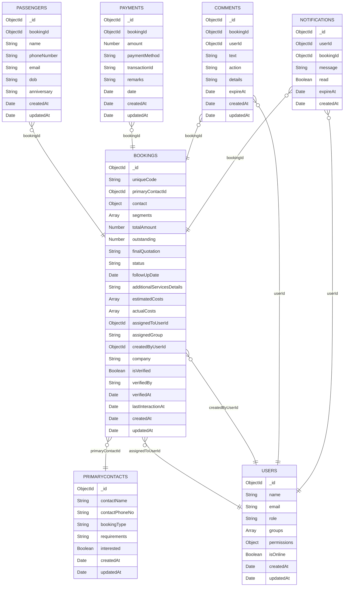

# CRM 3.0 — Final Database Schema
> State after all migration phases complete.  
> Use this as the reference when updating Mongoose models and writing new queries.

---

## ERD — Collection Relationships

---

## Collection 1 — `bookings` (567 documents)

### Top-level Fields

| Field | Type | Required | Notes |
|---|---|---|---|
| `_id` | ObjectId | auto | MongoDB primary key |
| `uniqueCode` | String | yes | Sequential ID e.g. `TW0638`. Unique + sparse index. |
| `primaryContactId` | ObjectId | yes | FK → `primarycontacts._id` |
| `contact` | Object | yes | Embedded snapshot — see sub-schema below |
| `segments` | Array | yes | Flight legs — see sub-schema below. Default `[]` |
| `totalAmount` | Number | yes | Single source of truth for selling price. Default `0` |
| `outstanding` | Number | yes | Remaining balance. Recalculated on every payment event |
| `finalQuotation` | String | no | Quotation suffix e.g. `TW0638-B` |
| `status` | Enum | yes | `Pending` · `Working` · `Sent` · `Booked` · `Follow Up` |
| `followUpDate` | Date | no | Next follow-up timestamp |
| `additionalServicesDetails` | String | no | Hotel / visa / transfer text notes |
| `estimatedCosts` | Array | yes | Expected cost breakdown — see sub-schema below |
| `actualCosts` | Array | yes | Confirmed cost breakdown — see sub-schema below |
| `assignedToUserId` | ObjectId | no | FK → `users._id`. Null = unassigned |
| `assignedGroup` | String | no | e.g. `Package / LCC` |
| `createdByUserId` | ObjectId | yes | FK → `users._id` |
| `company` | String | no | Travel agency name (B2B only) |
| `isVerified` | Boolean | yes | Manager verification flag. Default `false` |
| `verifiedBy` | String | no | Name of verifying manager |
| `verifiedAt` | Date | no | Verification timestamp |
| `lastInteractionAt` | Date | yes | Updated on every comment / status change |
| `createdAt` | Date | auto | Mongoose timestamps |
| `updatedAt` | Date | auto | Mongoose timestamps |

### Sub-schema — `contact` (embedded object)

> This is a **snapshot** of the primary contact at booking creation time.  
> It exists so the booking list query never needs a `$lookup` join on `primarycontacts`.

| Field | Type | Notes |
|---|---|---|
| `name` | String | Contact / agency name |
| `phone` | String | Phone with country code e.g. `+919888844882` |
| `type` | String | `Direct (B2C)` or `Agent (B2B)` |
| `requirements` | String | Raw lead requirement text |
| `interested` | Boolean | Lead interest flag |

### Sub-schema — `segments[]` (array of objects)

> Each object = one flight leg.  
> One-way trip → 1 segment. Round-trip → 1 segment (returnDate is set). Multi-city → multiple segments.

| Field | Type | Notes |
|---|---|---|
| `from` | String | Departure airport/city code e.g. `DXB` |
| `to` | String | Arrival airport/city code e.g. `BHJ` |
| `departureDate` | Date | Outbound departure date |
| `returnDate` | Date | Return date (null for one-way) |
| `returnDepartureTime` | String | Return leg departure time string |
| `tripType` | Enum | `one-way` · `round-trip` · `multi-city` |
| `country` | String | Destination country e.g. `India` |

### Sub-schema — `estimatedCosts[]` and `actualCosts[]`

| Field | Type | Notes |
|---|---|---|
| `type` | String | `Air Ticket` · `Hotel` · `Visa` · `Transport` |
| `price` | Number | Amount in booking currency |
| `source` | String | `Agent` · `Direct Vendor` |

### ❌ Fields Removed vs CRM 3.0 Legacy

| Removed Field | Why |
|---|---|
| `travelDate` | → `segments[0].departureDate` |
| `returnDate` | → `segments[0].returnDate` |
| `flightFrom` | → `segments[0].from` |
| `flightTo` | → `segments[0].to` |
| `tripType` | → `segments[0].tripType` |
| `destination` | → `segments[0].country` |
| `amount` | → merged into `totalAmount` |
| `includesFlight` | → derived: `segments.length > 0` |
| `includesAdditionalServices` | → derived: `additionalServicesDetails !== ""` |
| `pricePerTicket` | → unused legacy CRM 1.0 field |
| `travellers` | → derived: `passengers.countDocuments({ bookingId })` |
| `contact.email` | → never populated. Email lives in `passenger.email` if needed |

### Indexes

| Index | Type | Purpose |
|---|---|---|
| `{ _id: 1 }` | auto | primary key |
| `{ uniqueCode: 1 }` | unique, sparse | booking code lookup |
| `{ status: 1, "segments.0.departureDate": 1 }` | compound | calendar + upcoming trips |
| `{ assignedToUserId: 1, status: 1, lastInteractionAt: -1 }` | compound | agent dashboard |
| `{ createdAt: -1 }` | single | date-sorted list views |

---

## Collection 2 — `passengers` (104 documents)

> Stores **traveler identity only**. No flight data. Flight info lives in `bookings.segments`.

| Field | Type | Required | Notes |
|---|---|---|---|
| `_id` | ObjectId | auto | |
| `bookingId` | ObjectId | yes | FK → `bookings._id` |
| `name` | String | yes | Full name |
| `phoneNumber` | String | no | With country code |
| `email` | String | no | Personal email |
| `dob` | String | no | Date of birth `YYYY-MM-DD` |
| `anniversary` | String | no | Anniversary date `YYYY-MM-DD` |
| `createdAt` | Date | auto | |
| `updatedAt` | Date | auto | |

### ❌ Fields Removed vs CRM 3.0 Legacy

| Removed Field | Why |
|---|---|
| `flightFrom` | → `booking.segments[0].from` |
| `flightTo` | → `booking.segments[0].to` |
| `departureTime` | → `booking.segments[0].departureDate` |
| `returnDepartureTime` | → `booking.segments[0].returnDepartureTime` |
| `country` | → `booking.segments[0].country` |
| `tripType` | → `booking.segments[0].tripType` |
| `arrivalTime` | → was always empty. Removed. |
| `returnArrivalTime` | → was always empty. Removed. |
| `returnDate` | → was always empty. Removed. |
| `__v` | → Mongoose version key. Not used. |

### Indexes

| Index | Type | Purpose |
|---|---|---|
| `{ _id: 1 }` | auto | |
| `{ bookingId: 1 }` | single | fetch all passengers for a booking |

---

## Collection 3 — `primarycontacts` (567 documents)

> Stores the original lead/contact record.  
> The booking embeds a snapshot of this at creation time for fast list queries.

| Field | Type | Required | Notes |
|---|---|---|---|
| `_id` | ObjectId | auto | |
| `contactName` | String | yes | Person or agency name |
| `contactPhoneNo` | String | yes | With country code |
| `bookingType` | String | yes | `Direct (B2C)` or `Agent (B2B)` |
| `requirements` | String | no | Raw requirements text from lead |
| `interested` | Boolean | yes | Lead interest status. Default `false` |
| `createdAt` | Date | auto | |
| `updatedAt` | Date | auto | |

### ❌ Fields Removed vs CRM 3.0 Legacy

| Removed Field | Why |
|---|---|
| `contactEmail` | → was null in 563 of 567 records. 4 real values copied to `booking.contact.email` before removal. |
| `__v` | → Mongoose version key. Not used. |

### Indexes

| Index | Type | Purpose |
|---|---|---|
| `{ _id: 1 }` | auto | |
| `{ contactPhoneNo: 1 }` | single | duplicate detection on lead create |
| `{ contactName: 1 }` | single | name search |

---

## Collection 4 — `payments` (60 documents)

> No changes from CRM 3.0. This collection is clean.

| Field | Type | Required | Notes |
|---|---|---|---|
| `_id` | ObjectId | auto | |
| `bookingId` | ObjectId | yes | FK → `bookings._id` |
| `amount` | Number | yes | Amount paid in this transaction |
| `paymentMethod` | String | yes | `Bank Transfer` · `Cash` · `Card` · `Other` |
| `transactionId` | String | no | UTR / reference code |
| `remarks` | String | no | Internal payment notes |
| `date` | Date | yes | Date payment was recorded |
| `createdAt` | Date | auto | |
| `updatedAt` | Date | auto | |

### Indexes

| Index | Type | Purpose |
|---|---|---|
| `{ _id: 1 }` | auto | |
| `{ bookingId: 1 }` | single | fetch all payments for a booking |
| `{ date: -1 }` | single | payment history sorted by date |

---

## Collection 5 — `comments` (activities / timeline)

> Merged from legacy `activities` + `timelines` collections in masterMigrationV4.js.  
> TTL index added — comments auto-expire after 90 days to protect M0 storage.

| Field | Type | Required | Notes |
|---|---|---|---|
| `_id` | ObjectId | auto | |
| `bookingId` | ObjectId | yes | FK → `bookings._id` |
| `userId` | ObjectId | yes | FK → `users._id` |
| `text` | String | no | Manual comment text |
| `action` | String | no | System action e.g. `STATUS_CHANGE` · `ASSIGNED` · `VERIFIED` |
| `details` | String | no | Extended machine-readable log |
| `expireAt` | Date | yes | TTL field. Set to `createdAt + 90 days` on write |
| `createdAt` | Date | auto | |
| `updatedAt` | Date | auto | |

### Indexes

| Index | Type | Purpose |
|---|---|---|
| `{ _id: 1 }` | auto | |
| `{ bookingId: 1, createdAt: -1 }` | compound | booking timeline sorted newest first |
| `{ expireAt: 1 }` | TTL | auto-delete after 90 days |

---

## Collection 6 — `notifications`

> TTL index added — notifications auto-expire after 30 days.

| Field | Type | Required | Notes |
|---|---|---|---|
| `_id` | ObjectId | auto | |
| `userId` | ObjectId | yes | FK → `users._id` — who receives this |
| `bookingId` | ObjectId | no | FK → `bookings._id` — related booking |
| `message` | String | yes | Notification text |
| `read` | Boolean | yes | Default `false` |
| `expireAt` | Date | yes | TTL field. Set to `createdAt + 30 days` on write |
| `createdAt` | Date | auto | |

### Indexes

| Index | Type | Purpose |
|---|---|---|
| `{ _id: 1 }` | auto | |
| `{ userId: 1, read: 1 }` | compound | unread count per user |
| `{ userId: 1, createdAt: -1 }` | compound | notification feed |
| `{ bookingId: 1 }` | single | booking-level notification lookup |
| `{ expireAt: 1 }` | TTL | auto-delete after 30 days |

---

## Collection 7 — `users`

> `permissions` changed from Python-style string to proper typed object.

| Field | Type | Required | Notes |
|---|---|---|---|
| `_id` | ObjectId | auto | |
| `name` | String | yes | Display name |
| `email` | String | yes | Login email. Unique index. |
| `role` | String | yes | `ADMIN` · `AGENT` · `MANAGER` |
| `groups` | Array[String] | yes | Sales groups e.g. `["Package / LCC"]` |
| `permissions` | Object | yes | See sub-schema below |
| `isOnline` | Boolean | yes | Real-time presence. Default `false` |
| `createdAt` | Date | auto | |
| `updatedAt` | Date | auto | |

### Sub-schema — `permissions` (embedded object)

| Field | Type | Default | Notes |
|---|---|---|---|
| `leadVisibility` | String | `own` | `own` = see only assigned leads · `all` = see all |
| `canAssignLeads` | Boolean | `false` | Can reassign bookings to other agents |
| `canEditActualCost` | Boolean | `false` | Can modify actual cost figures |
| `canVerifyBookings` | Boolean | `false` | Can set isVerified = true |

### Indexes

| Index | Type | Purpose |
|---|---|---|
| `{ _id: 1 }` | auto | |
| `{ email: 1 }` | unique | login lookup |

---

## Collection 8 — `counters`

> Unchanged. Used for sequential `uniqueCode` generation (TW0001, TW0002…).

| Field | Type | Notes |
|---|---|---|
| `_id` | ObjectId | |
| `name` | String | e.g. `bookingCode` |
| `value` | Number | Current counter value. Incremented atomically on each booking create. |

---

## Collection 9 — `settings`

> Unchanged. Stores dropdown option lists for the UI.

| Field | Type | Notes |
|---|---|---|
| `_id` | ObjectId | |
| `type` | String | e.g. `destinations` · `flightSources` · `paymentMethods` |
| `values` | Array[String] | List of selectable options |

---

## Quick Reference — Where Data Lives Now

| Data Point | Old Location (CRM 3.0 legacy) | New Location (after migration) |
|---|---|---|
| Departure date | `booking.travelDate` | `booking.segments[0].departureDate` |
| Return date | `booking.returnDate` | `booking.segments[0].returnDate` |
| Flight from | `booking.flightFrom` + `passenger.flightFrom` | `booking.segments[0].from` |
| Flight to | `booking.flightTo` + `passenger.flightTo` | `booking.segments[0].to` |
| Trip type | `booking.tripType` + `passenger.tripType` | `booking.segments[0].tripType` |
| Destination country | `booking.destination` + `passenger.country` | `booking.segments[0].country` |
| Selling price | `booking.amount` + `booking.totalAmount` (same value) | `booking.totalAmount` only |
| Departure time | `passenger.departureTime` | `booking.segments[0].departureDate` |
| Return departure | `passenger.returnDepartureTime` | `booking.segments[0].returnDepartureTime` |
| Has flight? | `booking.includesFlight: Boolean` | `booking.segments.length > 0` |
| Has extras? | `booking.includesAdditionalServices: Boolean` | `booking.additionalServicesDetails !== ""` |
| Contact email | `primarycontacts.contactEmail` (usually null) | `passenger.email` per traveler |
| Passenger count | `booking.travellers` | `db.passengers.countDocuments({ bookingId })` |
